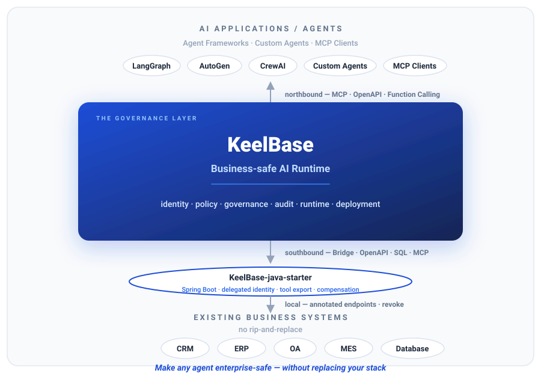
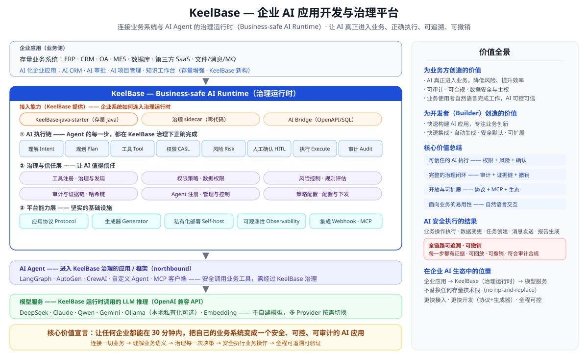

# KeelBase — 构建并安全运行业务 AI 应用

> **构建企业可以信任的 AI 应用——从零构建，或从存量系统出发。** 默认可治理、可审计、可私有部署。

<p align="center">
  
</p>

> **开源业务安全 AI 运行时（Business-safe AI Runtime）**——连接 AI Agent 与现有业务系统，**不替换现有技术体系**。

---

## 🚀 60 秒体验

> 想立刻体验？**打开在线演示** → [keelbase-demo](http://121.199.30.80/user/)（`alex/Alex@2026$Demo` 工作台，问「哪些客户值得跟进」）。访问指南：[demo-live.md](docs/manual/demo-live.md)。
>
> 或者**在线观看演示视频** → [官方中文演示（国内）](http://121.199.30.80/demo/video-zh.html) · [GitHub Pages](https://rain6fish.github.io/KeelBase/video-zh.html)（约 4 分钟，含真实系统演示；下载：GitHub release）。

只装 Docker，一条命令起完整应用（后端 + 工作台 + 管理台 + 移动预览），免构建：

```bash
docker run -d --name keelbase -p 3000:3000 ghcr.io/rain6fish/keelbase:latest
```

> 无需 LLM API Key 即可体验：未配置云端/本地模型时，AI 以**确定性演示模式**运行——黄金流程（分析→确认→创建→审计→撤销）开箱即用。配置 DeepSeek/Qwen/OpenAI/Ollama Key（`-e DEEPSEEK_API_KEY=...`）后自动切换真实 LLM。
>
> **随时重置到干净演示状态**：`docker rm -f keelbase && docker run -d --name keelbase -p 3000:3000 ghcr.io/rain6fish/keelbase:latest`——数据在容器内 SQLite（无 volume），删除容器即清空演示数据，下次启动自动重新 seed。

然后按 6 步走完黄金路径：

```text
1. 打开 http://localhost:3000           （工作台）——/admin 是管理台
2. 登录——alex/Alex@2026$Demo，或 admin/Admin@2026$KeelBase（所有环境一致）
3. 提问：「本周哪些客户风险最高？」
4. 看 AI 分析真实业务数据
5. 批准一个跟进任务             （人工确认）
6. 打开审计轨迹                 （每个动作都可查、可撤销）
```

想要只读演示站？`./deploy/demo.sh` → http://localhost:8080。

---

## 🎯 看 AI 真正干业务

旗舰应用 **AI CRM** 不是 Demo，而是一个可工作的产品闭环：

```text
你：
「本周哪些客户风险最高？」

KeelBase AI：
3 个客户需要关注…
  → 分析客户风险
  → 读取授权的订单与跟进记录
  → 创建跟进任务
  → 请求你确认
  → 写入 CRM
  → 记录审计
  → 可撤销
```

一个真实业务场景，胜过罗列二十个功能。

---

## 🎯 面向谁

同一个底座，两种用法。

**给 AI 原生开发者**——快速构建 AI 业务应用，而不是从零搭地基：
- 从一份协议约 30 分钟生成完整业务模块（实体 / CRUD / 权限 / AI 工具 / 审计）——真实、可编辑的代码，不是低代码引擎
- 自带大模型（云端或本地），数据始终由你掌控

**给已有业务系统的团队 / 集成商**——已有 CRM / ERP / OA 或十年前的 Java 系统，想让它们拥有 AI 能力：
- 把存量系统桥接进来（OpenAPI / SQL 结构 / Java 服务），无需推翻重来
- AI 在你真实数据之上做业务助手——风险分析、跟进建议、自动总结、审批
- 私有化部署：Docker / 离线 / 本地模型——数据不出域

> **独立平台，或连接存量系统**——KeelBase 本身即完整的应用开发平台（从协议生成全栈业务应用），同时也是面向存量系统的业务安全 AI 运行时。无需已有系统。

---

## 🔐 业务安全的设计

```text
用户请求 → AI 理解 → 业务数据 → 工具调用
        → 权限校验 → 人工确认
        → 副作用 → 审计 → 撤销
```

> **AI 可以行动——但只能在明确的业务边界内。**

- **数据范围限定**——每次工具调用携带登录用户上下文，AI 只能操作该用户的数据
- **写操作人工确认**——写操作执行前需用户明确批准
- **审计与撤销**——每个动作落在防篡改的审计哈希链上；AI 创建的副作用可追踪、可撤销
- **可解释**——「AI 为什么这么做？」由决策轨迹回答，不是黑盒

---

## 🏗 Build — AI 应用工程

从新业务模型或已有系统构建 AI 应用：

- **Application Protocol**——描述应用的人机可读 schema
- **`keelbase init`**——自然语言 / SQL 结构 / OpenAPI → 协议 → 带权限、AI 工具、确认、审计的完整业务模块
- **AI Bridge**——连接 Java/存量系统；AI 在治理约束下读写它

> 生成的产物是**普通源代码**。无专有运行时元数据。无拖拽锁定。

---

## ▶️ Run — AI 真正干业务

- 工具调用、RAG、记忆、子代理、主动 AI
- AI 读写**业务数据**——不只是聊天
- 每个工具调用限定范围、每个写操作确认、每个动作审计

---

## 🔒 Trust — 治理与审计

KeelBase 与普通 Agent 框架的区别所在：

- CASL 行级权限 · 工具治理 · 写操作确认
- 审计哈希链（防篡改）· 副作用幂等 · 撤销
- 决策轨迹 · AI 评测 · 提示词注入防御

### 企业安全验证（Enterprise Safety Validation）

这些不只是承诺——每一项都由仓库自带的可执行测试验证：

- ✓ **权限边界测试**——跨用户访问经 CASL 一律拒绝（越权矩阵 39 用例）
- ✓ **工具治理测试**——工具滥用 / 确认绕过 / 提示词注入全阻断（安全评测 12/12）
- ✓ **人工审批测试**——人工确认前写操作绝不落库（Golden Flow e2e）
- ✓ **审计完整性测试**——审计哈希链可验证、篡改即失败（`/audit/verify`）
- ✓ **Agent 行为测试**——决策轨迹 + 业务安全 Agent 基准（15/15 Run/Trust/Safety）
- ✓ **端到端业务流**——AI CRM：读 → 风险 → 建任务 → 确认 → 写 → 审计 → 撤销（确定性 e2e）

---

## 🏠 Deploy — 私有化设计

```text
云端 LLM  或  本地模型 / Ollama
        → 本地 Embedding → 本地 RAG → 业务安全 Agent → 本地审计
```

> **当你的数据不能离开环境时，整个 AI 应用都可以本地运行。**

Docker 单容器 · 内网/离线部署 · 本地模型与 Embedding。

---

## 🛠 构建你的第一个应用

```bash
npm install -g keelbase
keelbase init --desc "Customer management"
```

自然语言 → 模块规格 → 协议 → 应用代码 → AI 工具 → 治理。

完整流程：[30 分钟验收](docs/manual/30min-acceptance.md) · [开发挑战](docs/manual/dev-challenge.md)

---

## 📦 存量系统 AI 化

```text
已有 DB / OpenAPI / Java 系统
        → Application Protocol → 生成模块
        → AI 工具 + 治理 → 业务 Agent
```

让十年前的业务系统拥有 AI 能力，而无需推翻重来。

---

## 🧩 架构

一条主线——**Build → Run → Trust → Private Deploy**：

- **Build（AI 应用工程）**：Application Protocol（约定）；AI 生成业务模块——不做低代码引擎
- **Run（业务安全 Agent 运行时）**：工具调用限定数据范围、写操作人工确认、全链路审计 + 可撤销
- **Trust / Private Deploy（数据主权）**：数据不出域，AI 每步可查、可撤销

核心与 UI 框架无关；Flutter / Vue / React 都是 Renderer（[架构边界](docs/architecture-boundary.md)）。

## 📍 KeelBase 的位置

> **KeelBase 是企业 AI 信任运行时（Enterprise AI Trust Runtime）**——连接 AI Agent 与现有业务系统，在不替换现有技术体系的前提下，提供身份、治理、审计与私有部署能力。

```text
      AI 应用 / Agent
      Agent 框架
  LangGraph · AutoGen · CrewAI
  自定义 Agent · MCP 客户端
                    ▲
                    │ identity · policy · governance
                    │ audit · runtime · deployment
              ┌─────────────┐
              │  KeelBase   │
              │ Enterprise  │
              │ AI Trust    │
              │ Runtime     │
              └─────────────┘
                    │
                    │ bridge · protocol · capability mapping
                    ▼
      现有业务系统
      CRM · ERP · OA · MES · Database
```

- **上（AI 世界，northbound）**：任何 Agent 都能进入治理。Agent 框架经**开放标准（MCP / OpenAPI / 函数调用）**接入——KeelBase 不重造编排、Agent 循环或记忆策略
- **下（企业世界，southbound）**：任何业务系统都能具备 AI 能力。业务系统经 **Bridge（协议 + 能力映射）** 接入——无需替换
- **中间（信任层）**：identity · policy · permission · 人工确认 · 副作用控制 · 审计与撤销 · 私有部署



> *全貌：企业应用（存量业务系统 + 由 KeelBase 构建的 AI 化应用）→ KeelBase 治理运行时（接入能力 / AI 执行链 / 治理信任 / 平台能力）→ 它所调用的模型服务。*

---

## 📚 文档

> 所有手册提供**中文与 English** 双版本，按需选择。

- **快速开始 快速上手** — [中文](docs/manual/quickstart.md) · [English](docs/manual/quickstart-en.md)
- **从零到部署教程** — [中文](docs/manual/tutorial.md) · [English](docs/manual/tutorial-en.md)
- **30 分钟构建 AI CRM** — [中文](docs/manual/onboarding-30min.md) · [English](docs/manual/onboarding-30min-en.md)
- **30 分钟验收** — [中文](docs/manual/30min-acceptance.md) · [English](docs/manual/30min-acceptance-en.md)
- **开发者 30 分钟挑战** — [中文](docs/manual/dev-challenge.md) · [English](docs/manual/dev-challenge-en.md)
- **FAQ 常见问题** — [中文](docs/manual/faq.md) · [English](docs/manual/faq-en.md)
- **运维手册** — [中文](docs/manual/operations-zh.md) · [English](docs/manual/operations.md)
- **开发手册** — [中文](docs/manual/development-zh.md) · [English](docs/manual/development.md)
- **私有 AI 验证** — [中文](docs/manual/private-ai-verification.md) · [English](docs/manual/private-ai-verification-en.md)
- **三旗舰应用规格** — [中文](docs/flagship-applications.md) · [English](docs/flagship-applications-en.md)
- **企业能力声明** — [中文](docs/enterprise-capabilities.md) · [English](docs/enterprise-capabilities-en.md)
- **架构边界** — [中文](docs/architecture-boundary.md) · [English](docs/architecture-boundary-en.md)
- **权限架构** — [中文](docs/authorization-architecture.md) · [English](docs/authorization-architecture-en.md)
- **外部系统对接**
  - **AI Bridge 存量系统 AI 化** — [中文](docs/manual/ai-bridge.md) · [English](docs/manual/ai-bridge-en.md)
  - **轻量能力声明** — [中文](docs/manual/capability-declaration.md) · [English](docs/manual/capability-declaration-en.md)
  - **外部 CRM 接入演示** — [中文](docs/manual/external-crm-demo.md) · [English](docs/manual/external-crm-demo-en.md)
  - **Agent 框架接入** — [中文](docs/manual/framework-adapter.md) · [English](docs/manual/framework-adapter-en.md)
  - **Java Starter（Spring Boot 接入）** — 给 Java/Spring 方法加 `@KeelbaseTool` 注解即声明为 KeelBase 治理型 AI 工具：委托身份、读写确认、审计与撤销由 KeelBase 运行时自动落。 → [GitHub: rain6fish/KeelBase-java-starter](https://github.com/rain6fish/KeelBase-java-starter)
- [CLAUDE.md](CLAUDE.md)（架构与约定）· [AGENTS.md](AGENTS.md)（AI 构建规则）· [SECURITY.md](SECURITY.md)
- **浏览全部能力 →** [docs/](docs/)

---

## 🤝 社区与贡献

- [贡献指南](CONTRIBUTING.md) · [行为准则](CODE_OF_CONDUCT.md) · **Apache-2.0** 协议
- **问题与需求** → [github.com/rain6fish/KeelBase/issues](https://github.com/rain6fish/KeelBase/issues)
- 演示账号：`alex/Alex@2026$Demo`（工作台 / 移动端）· `admin/Admin@2026$KeelBase`（管理台）——所有环境一致

## 目录结构

| 目录 | 说明 |
|-----------|-------------|
| `Server-NestJS/` | NestJS 后端（REST API） |
| `Front-Flutter/` | 主用户 App（Flutter，iOS/Android/Web） |
| `Front-Taro/` | 主 App 的 H5/小程序端（Taro） |
| `Web-Admin-Vue/` | Web 端宿主：工作台 + 管理台同一壳（Vue3 + Element Plus） |
| `Web-Admin-React/` | 管理台 React 预览版（React 19 + MUI） |
| `docs/` | 规格、需求、手册 |

## 技术栈

Flutter 3.x · Vue3 + Element Plus · React 19（预览）· NestJS 11 + TypeORM · SQLite / PostgreSQL · Redis + BullMQ · JWT + CASL · OpenAI 兼容 LLM（DeepSeek / Qwen / OpenAI / Claude / Gemini）· pino + Prometheus + OpenTelemetry · Docker / Nginx · CI（GitHub Actions）
